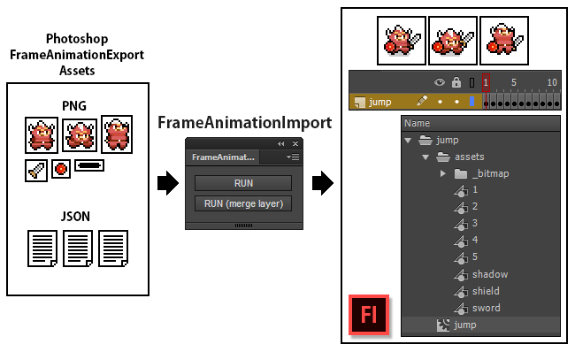
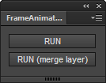
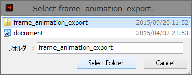
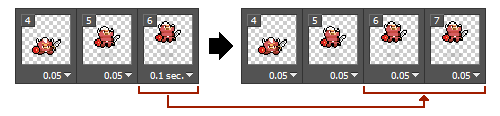

# FrameAnimationImport
=======

Document Language [English] | [[Japanese]](README_jp.md)

FrameAnimationImport is an extension panel for Flash Pro CC.
This reads FrameAnimationExport output data and convert to MovieClip.

* [FrameAnimationExport](https://github.com/siratama/FrameAnimationExport)

## Movie

[introduction movie](http://)

---
## Download

### zxp file (for Flash Pro CC)

* [FrameAnimationImport.zxp](https://raw.github.com/siratama/FrameAnimationImport/master/download/FrameAnimationImport.zxp)

This can be used by Flash CC 13.1 or later. In the case of Windows, it can save from a right-click. 
[Extension Manager Command Line tool(ExManCmd)](https://www.adobeexchange.com/resources/28) is required in order to install. 

### jsfl file (for Flash Pro Any Version)

* [FrameAnimationImport.jsx](https://raw.github.com/siratama/FrameAnimationImport/master/download/FrameAnimationImport.jsx)
* [FrameAnimationImportWithLayerMergence.jsx](https://raw.github.com/siratama/FrameAnimationImport/master/download/FrameAnimationImportWithLayerMergence.jsx)

## Etc Download

### Recommend jsfl

* [BitmapSmoothCut](https://github.com/siratama/BitmapSmoothCut)
* [FrameInsertEveryEachKeyFrame](https://github.com/siratama/FrameInsertEveryEachKeyFrame)

---
## How to use

* RUN: It's made by the layer structure of Photoshop.
* RUN(merge layer): A made layer is one. (Recommendation) 

After RUN button push down, you select a FrameAnimationExport output folder.

---
## FAQ

### I'd like to make the delay value of each frame of the Photoshop timeline frame animation applied MovieClip.

Every frame is 1 in MovieClip made by FrameAnimationImport with a cause of restriction of Photoshop jsx.
On the other hand you can handle a little by a Photoshop timeline frame adjustment.

For example the delay value is set as a multiple of 0.05.
A frame of 0.1 is split into two frames of 0.05.
An identical frame is two on the Flash Pro CC. That's a frame of (0.05 * 2 = 0.1) seconds.

