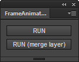
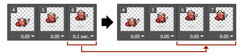

# FrameAnimationImport
=======

Document Language [[English](README.md)] | [Japanese]

FrameAnimationImport は Flash Pro CC 用 拡張パネルです。
FrameAnimationExport から出力したデータを読み込み、MovieClip として再現します。

* [FrameAnimationExport](https://github.com/siratama/FrameAnimationExport)

## 紹介動画

[introduction movie](http://)

---
## Download

### zxp file (for Flash Pro CC)

* [FrameAnimationImport.zxp](https://raw.github.com/siratama/FrameAnimationImport/master/download/FrameAnimationImport.zxp)

Flash CC 13.1 以降のバージョンで利用可能です。Windows の場合、右クリックから「リンク先のコンテンツを保存」を選択で保存できます。
インストールには別途 [Extension Manager Command Line tool(ExManCmd)](https://www.adobeexchange.com/resources/28)が必要です。

### jsfl file (for Flash Pro Any Version)

* [FrameAnimationImport.jsx](https://raw.github.com/siratama/FrameAnimationImport/master/download/FrameAnimationImport.jsx)
* [FrameAnimationImportWithLayerMergence.jsx](https://raw.github.com/siratama/FrameAnimationImport/master/download/FrameAnimationImportWithLayerMergence.jsx)

## Etc Download

### 併用お勧め jsfl

* [BitmapSmoothCut](https://github.com/siratama/BitmapSmoothCut)
* [FrameInsertEveryEachKeyFrame](https://github.com/siratama/FrameInsertEveryEachKeyFrame)

---
## 使い方

* RUN: Photoshop のレイヤー構造で Flash Pro CC 内にレイヤーが作成される
* RUN(merge layer): 作成されるレイヤーは一つ・使用推奨

RUN ボタン押下後、FrameAnimationExport で出力されたフォルダを選択します。

---
## FAQ

### Photoshop タイムラインフレームアニメーション 各フレームのディレイ値で設定したままのアニメーション表示になるようにしたい

Photoshop jsx の制限上、タイムラインのディレイ値を取得する事ができず、
FrameAnimationImport で生成される MovieClip はどのフレームも 1 として再現します。
これに対し、
Photoshop タイムラインフレーム数を調整する事で、ある程度の対処が行えます。

例えば Photoshop 上で設定するディレイ値は 0.05 の倍数に設定します。
0.1 のフレームは 0.05 二つのフレームに分割します。
これにより、Flash Pro CC 上では同一のフレームが二つとなり、0.05 * 2 = 0.1 秒のフレーム表示とする事が可能です。

